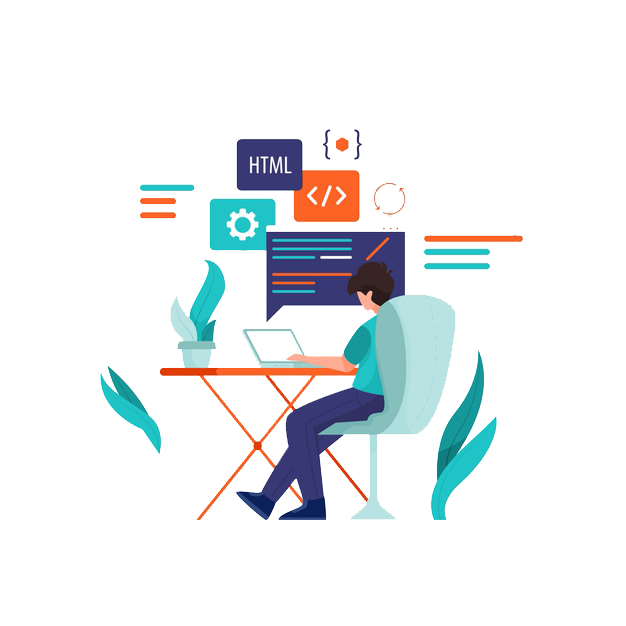

## Hi there 👋, It's **Shahzain**

#### `full-stack Developer` | `Nextjs` | `AWS`

I love exploring new tech stacks 💻 and leveraging them to build cool stuff 🛠️.

<h1 />

## 🛠️ Projects and Dev Stuffs:

	
  
<b>⚡ Github Stats</b>

   
  
  

	
  
<b>☄️ Github Streaks</b>

   
  

<h1 />

<h2 align="left">Connect with me:</h2>
 

  

